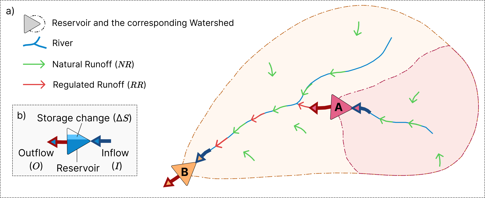

# ResORR - Reservoir Operations driven River Regulation

ResORR is a scalable, minimally parameterized model to estimate regulation of rivers due to upstream reservoir operations primarily using satellite observations of reservoir dynamcis. It is designed to work within the Reservoir Assessment Tool (RAT) framework, and can be easily initialized and run using an existing setup of [RAT 3.0](https://rat-satellitedams.readthedocs.io/en/latest/). The model is packaged as a python module and can be imported in jupyter notebooks or python scripts for further analysis. The next section describes how to use the model.

## Conceptual model
ResORR assumes that the water inflow to a reservoir is comprised of two components:

1. Natural Runoff (**NR**): Component of the generated upstream surface runoff that drains directly into the reservoir, without passing through any other upstream reservoirs. To calculate the NR, the concept of Theoretical Natural Runoff (**TNR**) is used. TNR is the inflow to the reservoirs if there were no upstream reservoirs. It can be estimated using classical hydrological models, such as VIC (**insert  link and reference**), that do not account for reservoir operations. For a reservoir $i$, the NR is then estimated as the difference between the TNR and sum of NRs of all upstream reservoirs. 

$$ NR_i=TNR_i-\sum_{j=1}^{N}NR_j $$

Where, $N$ is the number of upstream reservoirs. The figure below illustrates the concept of NR using green arrows.

2. Regulated Runoff (**RR**): Component of the generated upstream surface runoff that drains into the reservoir after passing through one or more upstream reservoirs. It is estimated as the sum of outflows from all upstream reservoirs. 

$$ RR_i=\sum_{j=1}^{N}O_j $$

Where, $O_j$ is the outflow from the upstream reservoir $j$, and is estimated as $O = I - \Delta S$. Here, $I$ is the inflow to the reservoir, and $\Delta S$ is the storage change in the reservoir, estimated by RAT 3.0. The figure below illustrates the concept of RR using red arrows.
The inflow to the reservoir is then estimated as the sum of the two runoff components. 

$$I=NR+RR$$

ResORR takes a reservoir network as one of the inputs, discussed in detail in the [input files required](#input-files-required) section. For a reservoir netork, it first topologically sorts the reservoir network, i.e., sorted in the order of upstream most to downstream most reservoirs. The model performs the following calculations over the sorted reservoir network for each time-step:

Let's take an example of the following dummy reservoir network:

For each time-step, the model would perform the following calculations:

- Reservoris 3, 4, and 5 do not have any upstream dams, and hence, the inflow would only be due to Natural Runoff, $I = NR = TNR$ and outflow would be $O = I - \Delta S$.

- Reservoir 2 has two immediately upstream reservoirs, 4 and 5. The inflow would be $I_2 = NR_2 + RR_2$, where $NR_2 = {TNR}_2 - ({NR}_4 + {NR}_5)$ and $RR = O_4 + O_5$. Outflow would be $O_2 = I_2 - \Delta S_2$.

- Reservoir 1 has two immediately upstream reservoirs, 2 and 3. The inflow would be $I_1 = NR_1 + RR_1$, where $NR_1 = {TNR}_1 - ({NR}_2 + {NR}_3)$ and $RR = O_2 + O_3$. Outflow would be $O_1 = I_1 - \Delta S_1$.

## Inputs required
* Theoretical Natural Runoff (`theoretical_natural_runoff`) - modeled inflow without considering upstream reservoir operations. 
* Storage Change (`storage_change`) - storage change in the reservoirs. 

Both these forcing variables need to be passed to the model as an `xarray.Dataset` - please refer to the [02-Regulation.ipynb](methods/02-Regulation.ipynb) notebook for an example on how to generate the forcings. Both these forcing variables, TNR and storage change, can be generated using RAT 3.0. For further details, please refer to the [RAT 3.0 documentation](https://rat-satellitedams.readthedocs.io/en/latest/).